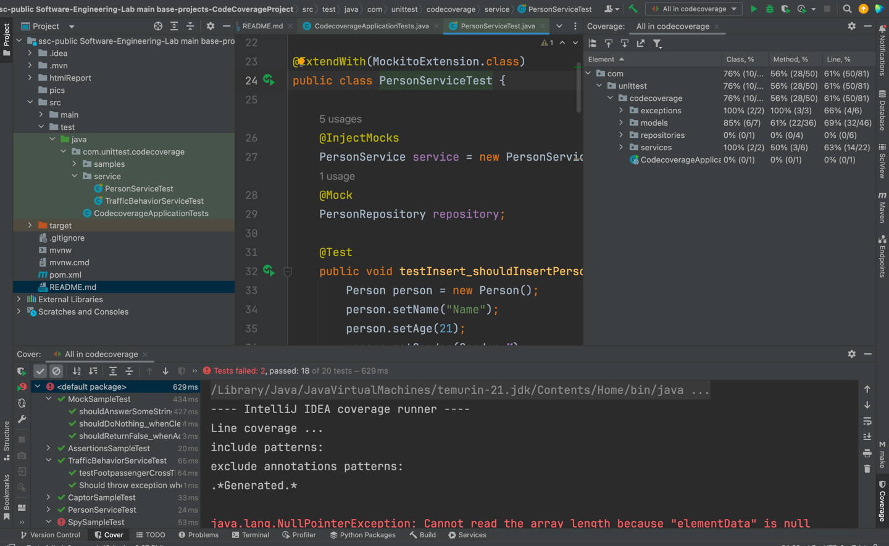
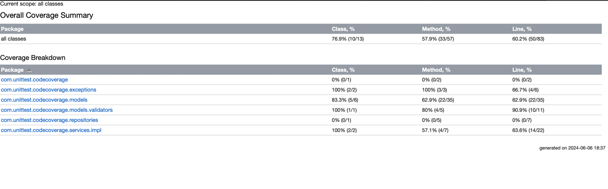
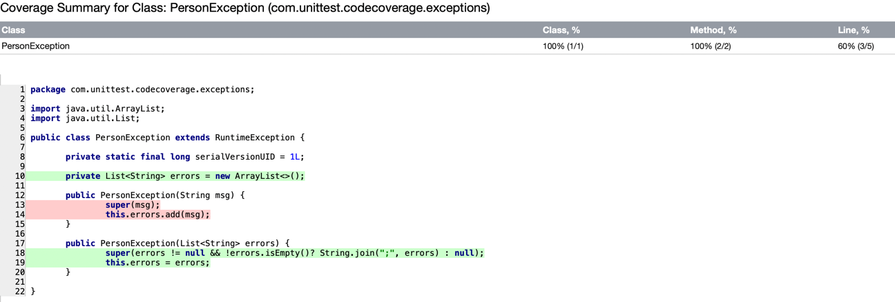

# گزارش آزمایش

## بررسی test coverage در پروژه CodeCoverageProject

اجرای تست‌ها با انتخاب گزینه Run Tests With Coverage

گرفتن خروجی درصد پوشش تست‌ها:

مشاهده خطوطی که توسط تست پوشش داده شده‌اند(رنگ سبز) و خطوطی که توسط تست پوشش داده نشده‌اند(رنگ قرمز):

