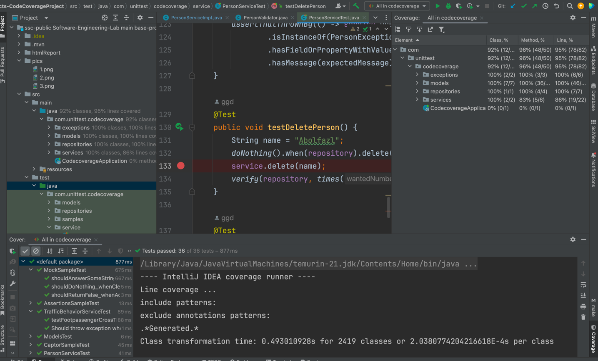

# گزارش آزمایش

لینک پروژه در گیتهاب: ‌https://github.com/mahdimostajer/SE_LAB_Test_Coverage
## بررسی test coverage در پروژه CodeCoverageProject

اجرای تست‌ها با انتخاب گزینه Run Tests With Coverage

گرفتن خروجی درصد پوشش تست‌ها:

مشاهده خطوطی که توسط تست پوشش داده شده‌اند(رنگ سبز) و خطوطی که توسط تست پوشش داده نشده‌اند(رنگ قرمز):

### بخش مدل‌ها (models):
    تست عبور از خط عابر پیاده (testPedestrianCrossing):

    
    @Test
    void testPedestrianCrossing() {
        Footpassenger footpassenger = new Footpassenger();
        footpassenger.setCrossedTheCrosswalk(true);

        boolean result = footpassenger.crossedTheCrosswalk();

        assertTrue(result, "Footpassenger should have crossed the crosswalk.");
    }
تست سن (testPersonAge):

    @Test
    public void testPersonAge() {
        Person person = new Person();
        person.setAge(14);
        assertEquals(person.getAge(), 14);
    }
تست جهت جریان خیابان (testStreetFlowDirection):

    @Test
    public void testStreetFlowDirection() {
        Traffic traffic = new Traffic();
        StreetDirectionFlow expected = StreetDirectionFlow.ONE_WAY;
        traffic.setStreetDirectionFlow(expected);
        assertEquals(expected, traffic.getStreetDirectionFlow());
        traffic.setStreetDirectionFlow(StreetDirectionFlow.TWO_WAY);
        assertEquals(StreetDirectionFlow.TWO_WAY, traffic.getStreetDirectionFlow());
    }

تست چراغ راهنمایی فعلی (testTrafficLightState):

    @Test
    public void testTrafficLightState() {
        Traffic traffic = new Traffic();
        TrafficLigth expected = TrafficLigth.YELLOW;
        traffic.setCurrentTrafficLight(expected);
        assertEquals(expected, traffic.getCurrentTrafficLight());
        expected = TrafficLigth.GREEN;
        traffic.setCurrentTrafficLight(expected);
        assertEquals(expected, traffic.getCurrentTrafficLight());
        expected = TrafficLigth.RED;
        traffic.setCurrentTrafficLight(expected);
        assertEquals(expected, traffic.getCurrentTrafficLight());    }
تست ترافیک شدید خودروها (testHeavyCarTraffic):

    @Test
    public void testHeavyCarTraffic() {
        Traffic  traffic = new Traffic();
        traffic.setIntenseCarTraffic(true);
        assertTrue(traffic.intenseCarTraffic());    }
تست حداقل سرعت مجاز (testMinimumSpeedLimit):

    @Test
    public void testMinimumSpeedLimit() {
        Traffic traffic = new Traffic();
        short expected = 60;
        traffic.setMinSpeedAllowed(expected);
        assertEquals(expected, traffic.getMinSpeedAllowed());
    }
}

تست حداکثر سرعت مجاز (testMaximumSpeedLimit):

        @Test
        public void testMaximumSpeedLimit() {
        Traffic traffic = new Traffic();
            short expected = 120;
            traffic.setMaxSpeedAllowed(expected);
            assertEquals(expected, traffic.getMaxSpeedAllowed());
        }

### بخش سرویس (service):
    تست حذف شخص (testRemovePerson):
    
	@Test
	public void testDeletePerson() {
		String name = "Abolfazl";
		doNothing().when(repository).delete(any(String.class));
		service.delete(name);
		verify(repository, times(1)).delete(name);
	}
}

تست حذف شخص نامعتبر (testRemoveInvalidPerson):

@Test
	public void testDeleteNull() {
	assertThatThrownBy(() -> service.delete(null)).isInstanceOf(PersonException.class).hasMessage("Name is required");

### بخش مخزن‌ها (repositories):
    تست درج شخص (testAddPerson):
    
    @Test
    public void testAddPerson() {
      PersonRepository  repository = new PersonRepository();
        Person person = new Person();
        person.setName("Mahdi");
        person.setAge(23);
        Person p = repository.insert(person);
        assertEquals(person, p);    }
تست دریافت شخص (testFindPerson):

    @Test
    public void testFindPerson() {
      PersonRepository  repository = new PersonRepository();
        String name = "Mahdi";
        Person result = repository.get(name);
        assertNull(result);    }
تست به‌روزرسانی شخص (testUpdatePersonDetails):

        @Test
        public void testUpdatePersonDetails() {
            PersonRepository repository = new PersonRepository();
            Person person = new Person();
            person.setName("Mahdi");
            person.setAge(23);

            Person p = repository.insert(person);
            p.setName("Abolfazl");
            p.setAge(22);
            assertDoesNotThrow(() -> repository.update(p));
            }
            

### توضیحات کلی در رابطه با تست‌ها
مدل‌ها (models):

    testPedestrianCrossing: بررسی می‌کند که آیا عابر پیاده از خط عابر پیاده عبور کرده است یا نه.
    testPersonAge: بررسی می‌کند که آیا متد getAge مقدار صحیح سن را که قبلاً با استفاده از setAge تنظیم شده است، برمی‌گرداند یا نه.
    testStreetFlowDirection: بررسی می‌کند که آیا جهت جریان خیابان به درستی تنظیم و بازگردانده می‌شود یا نه.
    testTrafficLightState: بررسی می‌کند که آیا چراغ راهنمایی به درستی تنظیم و بازگردانده می‌شود یا نه.
    testHeavyCarTraffic: بررسی می‌کند که آیا وضعیت ترافیک شدید خودروها به درستی تنظیم و بازگردانده می‌شود یا نه.
    testMinimumSpeedLimit: بررسی می‌کند که آیا حداقل سرعت مجاز به درستی تنظیم و بازگردانده می‌شود یا نه.
    testMaximumSpeedLimit: بررسی می‌کند که آیا حداکثر سرعت مجاز به درستی تنظیم و بازگردانده می‌شود یا نه.

سرویس (service):

    testRemovePerson: بررسی می‌کند که آیا متد delete در سرویس متد مشابهی در مخزن (repository) را فراخوانی می‌کند یا نه.
    testRemoveInvalidPerson: بررسی می‌کند که آیا در صورت حذف شخصی با نام null، استثنای (Exception) مناسب پرتاب می‌شود یا نه.

مخزن‌ها (repositories):

    testAddPerson: بررسی می‌کند که آیا متد insert در PersonRepository به درستی یک شیء Person را ذخیره می‌کند یا نه.
    testFindPerson: بررسی می‌کند که آیا متد get در PersonRepository می‌تواند یک شیء Person را بر اساس نام آن پیدا کند یا نه.
    testUpdatePersonDetails: بررسی می‌کند که آیا متد update در PersonRepository به درستی اطلاعات یک شیء Person را به‌روزرسانی می‌کند یا نه.

## تغییرات در درصد پوشش قسمت های مختلف:
### مخزن ها- مدل ها – سرویس ها - پوشش کلی

